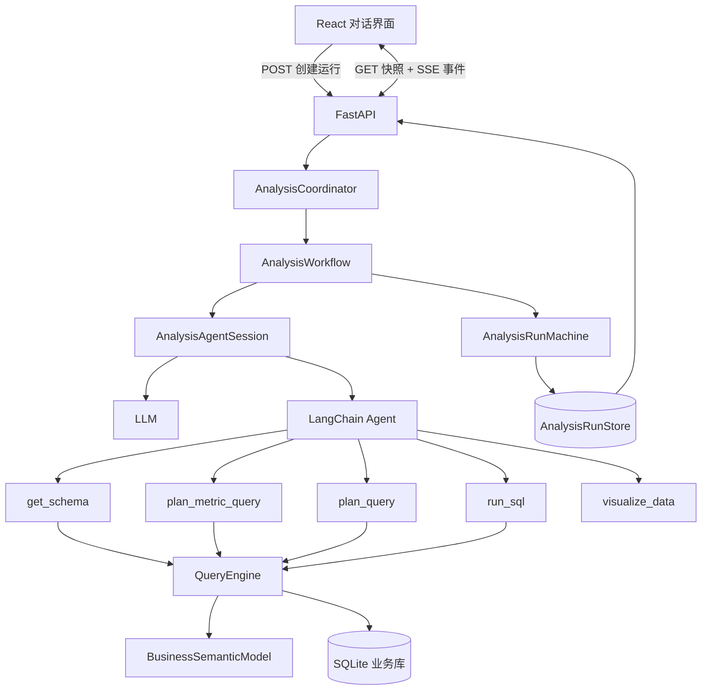
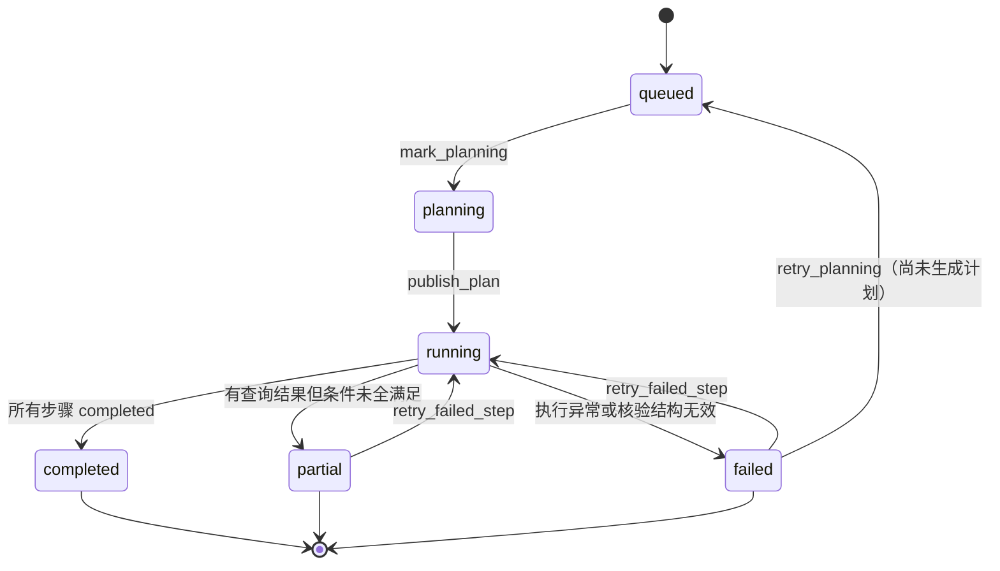
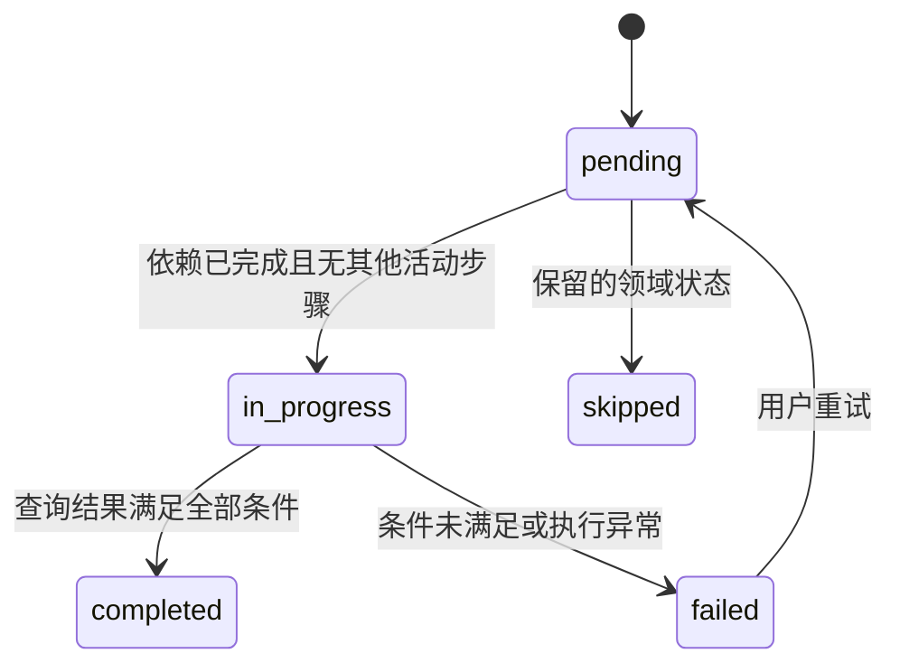
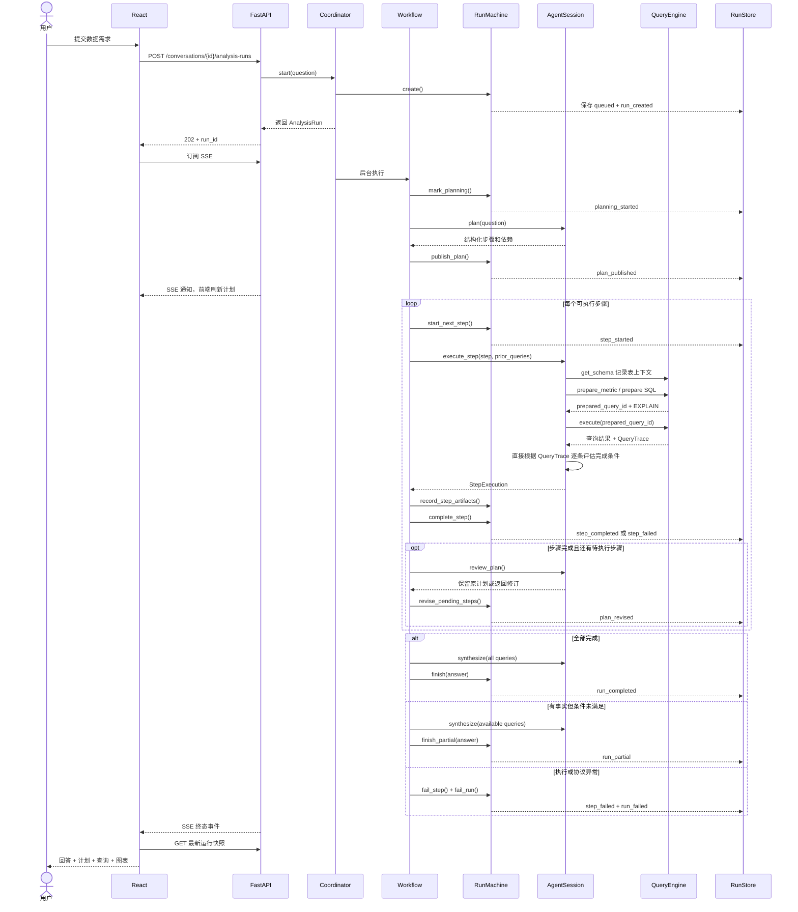
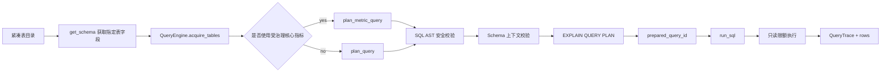

# DataAgent 工作流设计与实现详解

## 1. 文档目的

本文档详细说明 CommerceTrace 当前 DataAgent 从接收数据需求到返回分析结论的完整工作流，包括：

- 为什么采用“单 Agent 决策 + 确定性工作流”。
- 分析运行、分析计划、分析步骤、完成条件和查询工件的边界。
- 计划如何生成、校验、逐步执行和受限修订。
- Schema 获取、指标展开、SQL 准备、SQL 执行和结果核验如何形成不可跳过的安全链路。
- `completed`、`partial` 和 `failed` 的准确含义。
- 持久化、SSE 进度恢复、前端状态栏和失败重试的实现方式。
- 当前实现的能力边界和后续演进方向。

本文档描述的是当前已落地的实现，而不是理想化的未来架构。核心决策与 [ADR-0003](adr/0003-single-agent-deterministic-analysis-workflow.md)、[ADR-0004](adr/0004-evidence-gated-analysis-completion.md)、[ADR-0005](adr/0005-durable-analysis-runs.md) 和 [ADR-0006](adr/0006-versioned-business-semantic-model.md) 保持一致。

## 2. 设计结论

当前工作流的核心可以概括为：

> LLM 负责决定“分析什么、如何拆解、如何解释”；后端状态机和查询引擎负责保证“哪些环节不能跳过、什么时候才算完成、哪些事实必须被保留”。

具体原则如下：

1. 只使用一个数据分析 Agent，不为了展示“多 Agent”而增加角色交接成本。
2. 业务分析计划由 LLM 生成，但必须通过后端结构化模型和状态机校验。
3. 简单问题和复杂问题使用同一套运行模型：简单问题是单步计划，复杂问题是带前置依赖的多步计划。
4. 同一时刻最多只有一个分析步骤处于 `in_progress`。
5. 分析步骤的完成不由 Agent 的自由文本声明决定，而由“完成条件 + 实际查询结果 + 结构化核验结果”共同决定。
6. 获得了真实数据但未满足所有完成条件时，不丢弃数据，而是保留事实并将运行标记为 `partial`。
7. 每一条 SQL 必须遵循 `get_schema → prepare → execute` 链路，`run_sql` 不接受任意 SQL。
8. 运行快照和事件持久化到 SQLite，浏览器断线不会中止后台分析。
9. 计划可以根据新获得的事实修订，但只能替换尚未开始的步骤，已完成历史不可改写。

## 3. 三种不同的“计划”

系统中同时存在三种容易混淆的计划概念：

| 名称 | 含义 | 用户是否可见 | 例子 |
|---|---|---:|---|
| 分析计划 | 为回答业务问题而拆分的业务分析步骤 | 是 | 先核实销售额变化，再拆解渠道贡献 |
| SQL 执行计划 | SQLite `EXPLAIN QUERY PLAN` 返回的物理访问路径 | 作为查询工件可审查 | 是否全表扫描、如何使用索引 |
| Agent 工具调用序列 | Agent 在某个步骤内调用 `get_schema`、`plan_query`、`run_sql` 等工具的过程 | 不作为思维过程展示 | 先取得 `orders` 字段，再准备销售额查询 |

本文中没有限定词时，“计划”默认指用户可见的业务分析计划。

## 4. 核心术语

### 4.1 分析任务与分析运行

- **分析任务**：用户希望通过业务数据回答的问题或目标。
- **分析运行（`AnalysisRun`）**：该任务的一次可恢复执行记录。当前重试失败步骤时会继续使用同一个 `run_id`，而不是新建另一个运行。

### 4.2 步骤完成条件

步骤完成条件是执行前定义的数据需求和验收标准，例如：

> 取得两个周期的销售额、差额和变化率。

这是执行前的需求。它描述了“需要拿到什么数据才能完成步骤”，不能预设任何业务结论。

### 4.3 查询工件

受控查询执行后会产生 `QueryTrace`，直接保存 SQL、结果预览和执行信息。例如：

```json
{
  "query_id": "query_123",
  "purpose": "比较 6 月和 7 月销售额",
  "sql": "SELECT ...",
  "columns": ["june_revenue", "july_revenue", "change_rate"],
  "row_count": 1,
  "preview": [{"june_revenue": 120, "july_revenue": 96, "change_rate": -0.2}],
  "truncated": false
}
```

因此：

- 完成条件回答“需要什么”。
- `QueryTrace` 回答“执行了什么 SQL、真正查到了什么”。
- `CompletionConditionResult` 回答“查询结果是否足以满足每一条需求”。

当前实现不再维护 `AnalysisEvidence` 或查询结果的二级引用 ID。

## 5. 总体架构



各组件的责任边界：

| 组件 | 责任 | 不负责的事情 |
|---|---|---|
| `AnalysisCoordinator` | 创建后台任务、调度工作流、处理重试和关闭 | 不决定步骤是否完成 |
| `AnalysisWorkflow` | 按固定次序组合规划、执行、核验、修订和总结 | 不直接修改运行字段 |
| `AnalysisRunMachine` | 唯一的运行状态转移入口，校验不变式并产生事件 | 不调用 LLM 或数据库 |
| `AnalysisAgentSession` | 产生结构化计划、执行当前步骤、评估完成条件、建议修订和生成结论 | 不能绕过状态机改成完成状态 |
| `QueryEngine` | 强制 Schema 上下文、SQL 安全校验、EXPLAIN、准备凭证、只读执行和幂等结果 | 不决定分析步骤是否足够 |
| `BusinessSemanticModel` | 提供表、关系、指标、维度、同义词与治理规则的版本化事实源 | 不管理运行进度 |
| `AnalysisRunStore` | 原子保存最新快照和追加式事件 | 不执行后台任务 |

## 6. 领域模型

### 6.1 `AnalysisRun`

`AnalysisRun` 是前后端共同识别的顶层运行快照，关键字段如下：

| 字段 | 含义 |
|---|---|
| `run_id` | 一次持久化分析运行的唯一标识 |
| `conversation_id` / `user_id` | 会话归属和访问隔离 |
| `question` | 用户的原始数据需求 |
| `status` | `queued` / `planning` / `running` / `completed` / `partial` / `failed` |
| `plan` | 当前版本的分析计划 |
| `queries` / `charts` | 可审查查询工件和可视化工件 |
| `answer` | 基于已取得查询结果生成的最终回答或部分回答 |
| `error` | 运行级错误 |
| `usage` | 累计模型 token 用量 |
| `plan_revision_count` | 已使用的计划修订次数 |
| `event_sequence` | 当前最大事件序号，用于 SSE 增量恢复 |

### 6.2 `AnalysisPlan` 与 `AnalysisStep`

`AnalysisPlan` 包含版本号、最近一次修订原因和有序步骤。

每个 `AnalysisStep` 同时有两个标识：

- `step_key`：规划阶段生成的稳定逻辑标识，供 `depends_on` 引用。
- `step_id`：后端发布计划时生成的运行实例标识，供事件和 API 使用。

其他字段：

| 字段 | 含义 |
|---|---|
| `depends_on` | 必须先完成的前置 `step_key` 列表 |
| `title` | 前端计划状态栏展示的短标题 |
| `objective` | 本步骤要解决的业务分析目标 |
| `completion_conditions` | 执行前定义的数据需求与验收条件，1–5 条 |
| `status` | `pending` / `in_progress` / `completed` / `failed` / `skipped` |
| `completion_results` | 每条完成条件的核验结果 |
| `error` | 执行错误，或未满足条件的解释 |

### 6.3 `CompletionConditionResult`

每条完成条件都必须产生一个对应结果：

```json
{
  "condition": "取得两个周期的销售额、差额和变化率",
  "satisfied": true,
  "explanation": "查询返回两个周期的聚合值及环比结果"
}
```

状态机强制：

- `condition` 集合必须与步骤原始 `completion_conditions` 完全一致。
- 每个条件都必须有且只有一个结构化核验结果。
- 未满足条件必须通过 `explanation` 说明还缺什么。

## 7. 运行和步骤状态机

### 7.1 运行状态



状态含义：

| 运行状态 | 含义 | 是否终态 | 是否可重试 |
|---|---|---:|---:|
| `queued` | 运行已创建，尚未开始生成计划 | 否 | 否 |
| `planning` | Agent 正在生成结构化分析计划 | 否 | 否 |
| `running` | 计划已发布，正在逐步执行 | 否 | 否 |
| `completed` | 所有步骤的完成条件均已满足 | 是 | 否 |
| `partial` | 取得了可用事实，但至少一个步骤的完成条件未全满足 | 是 | 是，前提是存在 `failed` 步骤 |
| `failed` | 执行过程出错，或核验结构不符合协议 | 是 | 是，前提是存在 `failed` 步骤 |

### 7.2 步骤状态



当前工作流不会主动产生 `skipped`，该状态是为后续计划取消或分支收敛预留的模型能力。

## 8. 从用户问题到最终回答的完整时序



## 9. 阶段一：创建持久化分析运行

前端提交问题时，不等待整个 Agent 完成，而是调用：

```http
POST /api/conversations/{conversation_id}/analysis-runs
Content-Type: application/json

{"message": "为什么上个月销售额下降？"}
```

后端依次执行：

1. 通过 HttpOnly cookie 确认当前匿名用户。
2. 校验会话归属，防止跨用户读取运行。
3. 先把用户问题写入会话历史。
4. 创建 `AnalysisRun(status=queued)` 和第一个 `run_created` 事件。
5. 在向客户端返回 `202 Accepted` 之前先持久化运行。
6. `AnalysisCoordinator` 用 `asyncio.create_task` 在 FastAPI 进程中启动后台工作流。

这使“一次分析运行”不再等价于“一次长 HTTP 请求”。

## 10. 阶段二：生成和发布分析计划

### 10.1 Agent 生成的结构

`AnalysisAgentSession.plan()` 通过 LLM 结构化输出生成 `AnalysisStepDraft[]`。规划 Prompt 要求：

- 步骤必须是业务分析目标，不能写成工具调用、SQL 或 Schema 获取。
- 简单问题只生成一步。
- 复杂问题 Prompt 限制为最多六步，后端模型的硬上限为八步。
- 每步必须定义 1–5 条完成条件。
- 完成条件不能预设最终数据结论。
- 每步有唯一 `step_key`。
- `depends_on` 只能引用排在当前步骤之前的 `step_key`。

示例：

```json
[
  {
    "step_key": "baseline",
    "depends_on": [],
    "title": "核实销售额变化",
    "objective": "比较当期与上一对比周期的销售额",
    "completion_conditions": ["取得两个周期的销售额、差额和变化率"]
  },
  {
    "step_key": "channel_breakdown",
    "depends_on": ["baseline"],
    "title": "拆解渠道贡献",
    "objective": "定位造成销售额变化的主要渠道",
    "completion_conditions": ["取得各渠道变化金额和对总变化的贡献率"]
  }
]
```

### 10.2 后端发布前的硬校验

`AnalysisRunMachine.publish_plan()` 强制以下不变式：

1. 计划不能为空。
2. 不能超过最大步骤数。
3. `step_key` 不能重复。
4. 依赖不能重复，不能依赖自己。
5. 依赖只能指向更早的步骤，因此天然排除前向引用和循环依赖。
6. 一个运行只能发布一次初始计划。

校验通过后，后端为每个步骤分配 `step_id`，把运行状态改为 `running`，并发出 `plan_published` 事件。

## 11. 阶段三：选择下一个可执行步骤

`start_next_step()` 不是简单地把第一个 `pending` 步骤改成进行中，它先强制两个条件：

1. 当前计划中不存在其他 `in_progress` 步骤。
2. 候选步骤的所有 `depends_on` 都已经处于 `completed`。

工作流选择有序计划中第一个满足依赖的步骤。当前实现是顺序执行器，即使两个步骤互不依赖，也不会并行启动。

开始后，步骤状态变为 `in_progress`，产生 `step_started` 事件并立即持久化，因此用户可以看到“正在执行哪一步”。

## 12. 阶段四：在单个步骤内执行受控数据分析

### 12.1 步骤级 Agent 上下文

`execute_step()` 每次只把以下内容交给 Agent：

- 用户的原始问题。
- 当前步骤的标题和目标。
- 当前步骤的全部完成条件。
- 前序步骤已取得的查询结果。
- 与问题相关的已确认 few-shot 记忆。

Prompt 要求 Agent 只执行当前步骤，必须先取得 Schema，必须准备后再执行查询，没有实际查询结果不得声称步骤完成。

当前 `ChatDeepSeek` 创建时会通过 `extra_body` 显式禁用 Thinking 模式。原因是规划、条件核验和计划修订使用 LangChain `with_structured_output()`，该适配器会通过强制命名 `tool_choice` 取得 Pydantic 结构，而 DeepSeek V4 Thinking 模式不接受该组合。确定性工作流优先保证结构化协议稳定，因此当前不开放 Thinking 开关。

### 12.2 查询的强制链路



#### A. 渐进披露 Schema

系统 Prompt 只包含紧凑表目录：表名、业务描述和关系，不包含所有列定义。

- `get_schema()` 不传表名时只返回紧凑目录，不授予任何表的查询上下文。
- `get_schema(["orders"])` 返回 `orders` 的列级定义，并在本步骤的 `QueryEngine` 中记录 `orders` 已被显式取得。
- 未知表或非白名单表会返回 `schema_table_denied`。
- 查询引用了尚未显式取得的表时，准备阶段返回 `schema_context_required`。

因此，“必须先取得 Schema”不再只是 Prompt 建议，而是查询引擎可验证的运行前置条件。

#### B. 受治理指标的确定性展开

`BusinessSemanticModel` 是表、关系、指标、维度、同义词和治理规则的唯一事实源。它会校验：

- 指标引用的源表必须存在。
- 指标 ID、名称和同义词不能冲突。
- 维度引用的表和列必须存在。
- 维度 ID、名称和同义词不能冲突。

`plan_metric_query` 接受指标 ID、名称或同义词。例如“销售额”、“成交额”和 `revenue` 都能解析为同一指标。它把指标和同表维度展开为确定性 SQL，例如：

```sql
SELECT
  ecommerce.orders.channel AS order_channel,
  SUM(ecommerce.orders.total_amount) AS revenue
FROM ecommerce.orders
WHERE ecommerce.orders.status IN ('paid', 'completed')
GROUP BY ecommerce.orders.channel
```

当前只有标记为 `deterministic_sql=true` 的核心指标可由后端展开。跨表维度和组合指标尚未实现通用语义 SQL 编译。

#### C. SQL 准备而不是直接执行

`plan_query` 和 `plan_metric_query` 最终都进入 `QueryEngine.prepare()`，执行：

1. 用 `sqlglot` 解析 SQL AST。
2. 仅允许单条 `SELECT` / `UNION` / `INTERSECT` / `EXCEPT`。
3. 禁止写入、DDL、事务、拷贝和危险数据库函数。
4. 仅允许访问 `ecommerce` schema 内的语义模型白名单表。
5. `DISTINCT` 值级探索仅允许低基数、非敏感白名单列。
6. 根据 AST 提取真实物理表，校验它们都已通过 `get_schema` 取得。
7. 生成 `EXPLAIN QUERY PLAN`，保存执行计划和全表扫描表。
8. 将规范化 SQL 与当前业务语义模型指纹绑定。
9. 签发一个随机 `prepared_query_id`，并将准备查询保留在当前 `QueryEngine` 内存中。

准备阶段不返回业务数据。

#### D. 凭证式只读执行

`run_sql` 只接受 `prepared_query_id`，不接受 SQL 字符串。`QueryEngine.execute()` 会再次确认：

- 凭证在当前查询引擎中存在。
- 准备时的语义模型指纹与执行时一致。
- SQL 仍然能通过安全策略校验。

真正执行时，引擎创建内存 SQLite 连接，以 `ATTACH DATABASE` 挂载业务库，开启 `PRAGMA query_only = ON`，加入语句超时和结果行数上限。

同一 `prepared_query_id` 重复执行时返回缓存的同一 `QueryResult`，不会重复访问数据库。

### 12.3 查询工件 `QueryTrace`

每条成功执行的查询都产生一条可审查轨迹：

| 字段 | 用途 |
|---|---|
| `query_id` | 查询和图表引用的执行标识 |
| `prepared_query_id` | 追溯到具体准备凭证 |
| `purpose` | 该查询要验证的分析目的 |
| `sql` | 实际执行的规范化 SQL |
| `plan` | `EXPLAIN QUERY PLAN` 结果 |
| `semantic_fingerprint` | 查询准备时的业务语义模型版本指纹 |
| `columns` / `row_count` | 返回列和行数 |
| `preview` | 持久化的最多 20 行预览 |
| `execution_time_ms` | 查询耗时 |
| `truncated` | 是否因结果上限被截断 |

图表通过 `source_query_id` 引用查询工件，不允许与数据来源脱节。

## 13. 阶段五：保存查询工件

Agent 完成当前步骤后，`AnalysisWorkflow` 会把本步骤产生的 `QueryTrace` 交给状态机持久化。每条查询工件包含：

- 查询目的、规范化 SQL 和执行计划。
- 查询列名和返回行数。
- 最多 20 行数据预览和截断标志。
- 执行时间、准备凭证和业务语义指纹。

查询工件是后续步骤、计划修订和最终回答的直接输入，不再复制为另一层事实对象。

如果步骤没有执行查询，`AnalysisAgentSession` 不会生成完成条件核验结果；状态机会因为核验结果不完整而拒绝完成步骤。

## 14. 阶段六：逐条核验完成条件

只要本步骤存在查询结果，`AnalysisAgentSession` 就使用结构化 LLM 输出产生 `CompletionConditionResult[]`。

核验 Prompt 限制：

- 必须逐条处理完成条件。
- `condition` 必须原样返回。
- `satisfied` 只能依据给定的查询结果。

然后由状态机校验结果数量和条件集合。

需要特别注意：当前“查询结果是否语义上满足条件”仍由 LLM 做结构化判断；状态机能确保它没有漏条件，但尚未对每种完成条件实现确定性的业务验证器。

## 15. 阶段七：完成、部分完成与失败

### 15.1 步骤完成

同时满足以下条件时，步骤才能进入 `completed`：

1. 每条完成条件都有且只有对应的结构化核验结果。
2. 所有条件都是 `satisfied=true`。

步骤完成后发出 `step_completed`。只有计划中的所有步骤都是 `completed`，运行才能进入 `completed`。

### 15.2 有真实数据但完成条件未全满足

这是本工作流特别区分的场景。

状态机会先保存：

- 已执行查询和图表。
- 模型 token 用量。
- 每条完成条件的核验结果。
- 所有未满足条件的 `explanation`。

然后：

1. 当前步骤标记为 `failed`。
2. 步骤 `error` 保存所有未满足解释。
3. Agent 只基于已获得查询结果生成有限结论。
4. 整个运行标记为 `partial`。
5. 前端展示已有结果、未满足原因和“重试失败步骤”按钮。

“步骤 `failed` + 运行 `partial`”并不矛盾：步骤没有达到它的验收标准，但整个运行已经取得了可向用户报告的真实事实。

当前工作流遇到第一个这类步骤后会立即以 `partial` 收束，不会继续执行其他可能独立的待处理步骤。

### 15.3 执行或协议失败

以下场景会进入运行级 `failed`：

- 完成条件核验结果数量或条件集合不完整。
- Agent、数据库、持久化或其他执行环节抛出异常。

如果异常发生时有正在执行的步骤，工作流会先将该步骤标记为 `failed`，再将运行标记为 `failed`，并持久化两个事件。

## 16. 受限的动态计划修订

每个步骤成功完成后，只要还有待执行步骤且修订预算尚未用完，工作流就调用 `review_plan()`。

Agent 会看到：

- 原始问题。
- 刚完成的步骤。
- 当前待执行步骤。
- 所有已获得的查询结果。
- 剩余修订次数。

只有当新查询结果表明原计划无法回答问题时，Agent 才应该返回修订。修订结果包含必填的 `reason` 和一组替换步骤。

状态机强制：

1. 有 `in_progress` 步骤时不能修订计划。
2. 修订原因不能为空。
3. 默认最多修订两次。
4. 修订后的总步骤数不能超过八步。
5. 所有非 `pending` 步骤按原对象保留，待执行步骤整体替换。
6. 新计划仍必须通过 `step_key` 唯一性和前置依赖校验。
7. 修订版本号加一，原因持久化并发出 `plan_revised`。

这种方式允许 Agent 根据数据动态改变后续分析路径，但不允许静默改写已经展示给用户的完成历史。

## 17. 最终结论合成

工作流把 `AnalysisRun.queries` 中已持久化的查询结果交给 `synthesize()`。合成 Prompt 要求：

- 只使用提供的实际数据事实。
- 先给结论，再说明数据依据、统计口径和限制。
- 不得把观察结果表述为严格因果。
- 不得用推测补齐未取得的事实。

`completed` 运行和 `partial` 运行都可以生成 `answer`；两者的区别在于完成度和运行状态，不在于是否有回答文本。

运行结束后，`AnalysisCoordinator` 会把带有查询、图表和 token 用量的回答写入会话历史。

## 18. 持久化模型

`AnalysisRunStore` 在 Agent 状态 SQLite 中管理两张表：

### 18.1 `analysis_runs`

保存每个运行的最新完整 JSON 快照，包括计划、查询、图表、最终回答、用量和当前事件序号。

### 18.2 `analysis_events`

按 `(run_id, sequence)` 保存追加式事件。事件用 `INSERT OR IGNORE` 写入，因此同一序号重复持久化不会产生重复记录。

`save()` 在同一 SQLite 事务中：

1. upsert 最新运行快照。
2. 写入本次尚未持久化的事件。
3. 提交后从内存事件缓冲区移除已保存部分。

这使读取快照和按序号追播事件可以同时成立。

## 19. 运行事件

| 事件 | 产生时机 | 关键负载 |
|---|---|---|
| `run_created` | 运行创建 | 初始状态 |
| `planning_started` | 开始生成计划 | 运行状态 |
| `plan_published` | 初始计划校验并发布 | 完整计划快照 |
| `plan_revised` | 待执行计划被解释性修订 | 新计划和修订原因 |
| `step_started` | 步骤进入进行中 | 当前步骤快照 |
| `step_artifacts_recorded` | 查询、图表和用量归档 | query/chart ID 和用量 |
| `step_completed` | 全部完成条件已满足 | 步骤和核验结果 |
| `step_failed` | 执行失败或完成条件未满足 | 步骤；条件未满足时还包含核验结果 |
| `run_completed` | 所有步骤完成 | 最终回答和状态 |
| `run_partial` | 有事实但未全部满足验收条件 | 有限回答和状态 |
| `run_failed` | 运行级异常 | 错误和状态 |
| `run_retried` | 失败步骤重置后重新调度 | 被重试步骤和状态 |

事件类型由后端 `AnalysisEventType` 和前端 TypeScript 联合类型统一约束，避免在多处随意拼写事件名。

## 20. API 与 SSE 恢复

### 20.1 API

| 方法 | 路径 | 用途 |
|---|---|---|
| `POST` | `/api/conversations/{id}/analysis-runs` | 创建后台分析运行，返回 `202` |
| `GET` | `/api/analysis-runs/{run_id}` | 读取当前完整快照 |
| `GET` | `/api/conversations/{id}/analysis-runs/latest` | 打开历史会话时恢复最近运行 |
| `GET` | `/api/analysis-runs/{run_id}/events` | 订阅 SSE 事件 |
| `POST` | `/api/analysis-runs/{run_id}/retry` | 重试第一个失败步骤，或在初始规划失败后重新生成计划 |

所有运行读取和重试都使用 cookie 中的 `user_id` 做所有权校验，未授权访问统一表现为资源不存在。

### 20.2 SSE 增量事件

SSE 端点同时支持：

- `?after=<sequence>` 查询参数。
- `Last-Event-ID` 请求头。

服务器从两者的较大值开始读取，按 `sequence` 升序发送事件。每个 SSE 消息包含：

```text
id: 6
event: step_completed
data: {...}
```

服务器当前每 100ms 读取一次持久化事件，直到：

- 运行进入 `completed`、`partial` 或 `failed`。
- 客户端断开连接。
- 运行被删除。

浏览器连接中断时，后台 `asyncio` 任务不会因 SSE 断开而取消。

## 21. 前端计划状态栏

前端交互参考 Claude Code 和 Codex 的计划执行状态：

1. 创建运行后立即显示工作状态。
2. 收到 `plan_published` 后展示分点计划。
3. `pending` 步骤显示序号和完成条件。
4. `in_progress` 步骤显示为当前活动项。
5. `completed` 步骤显示勾选/划去效果。
6. `failed` 步骤显示实际错误或未满足条件的解释。
7. 计划修订后显示当前修订版本和修订原因。
8. `partial` 或 `failed` 运行存在失败步骤时，显示重试按钮。

前端不直接依赖 SSE 负载重建所有页面状态。它把 SSE 当作“状态已变化”的通知，然后调用 `GET /api/analysis-runs/{run_id}` 读取最新完整快照。这样可以避免前端因遗漏某个事件而构造出不一致状态。

重新打开会话时，前端先读取会话历史，再读取最近的分析运行。如果运行尚未进入终态，则重新订阅 SSE。

## 22. 失败步骤重试

用户只能对 `partial` 或 `failed` 运行发起重试。当计划已存在时，后端处理如下：

1. 从 SQLite 读取运行最新快照。
2. 如果同一 `run_id` 仍有后台任务，返回 `409 run_already_running`。
3. 选择计划中第一个 `failed` 步骤。
4. 把该步骤重置为 `pending`，清除它当前的 `error` 和 `completion_results`。
5. 把运行改回 `running`，清除运行级 `error` 和上一次有限回答。
6. 保留运行中已存在的查询工件、已完成步骤和历史事件。
7. 发出 `run_retried` 并重新调度同一套工作流。

重试后 `AnalysisWorkflow` 发现计划已存在，因此不会重新生成整个计划，而是从被重置的失败步骤继续。

如果运行在初始规划阶段就失败，此时 `plan` 为空，后端会把运行重置为 `queued`，清除错误和旧回答，发出带 `phase=planning` 的 `run_retried`，然后重新执行计划生成。前端在这种状态下显示“重新生成分析计划”。

## 23. 数据安全与可审计性

当前工作流同时使用多层约束，不把安全寄托在单一 Prompt 上：

| 层级 | 约束 |
|---|---|
| 会话/API | HttpOnly cookie 归属校验，防止跨用户读取运行 |
| 业务语义 | 表、字段、指标、维度和探索列从版本化语义模型派生 |
| Schema 上下文 | 只能查询当前步骤中已显式获取列定义的表 |
| SQL AST | 单条只读查询、schema/表白名单、危险节点与函数拦截 |
| 值级探索 | `DISTINCT` 仅允许语义模型声明的低基数非敏感列 |
| 准备/执行 | 用不可猜测的 `prepared_query_id` 分离 SQL 文本和执行权限 |
| 语义版本 | prepared query 绑定语义指纹，指纹改变后必须重新准备 |
| 数据库 | `PRAGMA query_only = ON`、语句超时、最大返回行数 |
| 完成判定 | 完成条件核验结果必须完整且与原条件集合一致 |
| 审计轨迹 | 保存 SQL、EXPLAIN、语义指纹、行数、耗时、预览和有序事件 |

## 24. 一个完整的复杂分析示例

用户问题：

> 为什么 7 月销售额比 6 月下降？

可能的初始计划：

1. `baseline`：核实两个月的销售额、差额和变化率。
2. `channel_breakdown`：依赖 `baseline`，计算各订单渠道的变化金额和贡献率。
3. `category_breakdown`：依赖 `baseline`，计算各品类的变化金额和贡献率。

执行步骤 1：

1. Agent 获取 `orders` Schema。
2. 由于问题包含时间周期筛选，Agent 按语义模型中的 `revenue` 口径构造带周期条件的 SQL，并调用 `plan_query`。若只查询全量指标或按同表维度分组，则优先使用 `plan_metric_query`。
3. 查看 EXPLAIN 并取得 prepared query ID。
4. 执行查询，得到 6 月、7 月数值与环比。
5. 直接根据查询结果核验“两个月、差额、变化率”是否齐全。

如果查询证明渠道变化已经足以解释总变化，计划审查可以返回修订，删除原来尚未开始的品类拆解，并记录调整原因。已完成的基线步骤不会被重写。

如果渠道查询只返回了变化金额，但没有计算贡献率，完成条件不满足。系统会：

- 保留已查到的渠道变化金额。
- 记录“缺少贡献率”。
- 将渠道步骤标记为 `failed`。
- 用已有事实生成部分回答。
- 将运行标记为 `partial`，允许用户重试该步骤。

## 25. 测试与验证接缝

当前自动化测试直接覆盖以下公共行为：

| 测试文件 | 覆盖行为 |
|---|---|
| `test_semantic_model.py` | 语义模型表权限派生、指标/维度同义词、核心指标 SQL 展开、版本指纹 |
| `test_query_engine.py` | Schema 上下文门、准备后执行、指标查询、幂等结果、EXPLAIN 轨迹 |
| `test_analysis_run.py` | 顺序状态转移、依赖校验、完成条件、动态修订和重试 |
| `test_analysis_workflow.py` | 端到端工作流、计划修订、部分完成、查询计划工件保留 |
| `test_analysis_api.py` | 运行创建、快照重连、SSE 事件和公共 API 重试 |

完整验证命令：

```bash
npm test
npm run lint
npm run typecheck
npm run build
```

## 26. 当前实现边界

以下是文档化的现实限制，不应被误认为已经具备的能力：

1. **后台执行仍在 FastAPI 进程内。** 快照和事件可持久化，但服务进程崩溃后不会自动恢复尚未结束的 `asyncio` 任务。
2. **步骤不并行。** 计划已表达依赖，但执行器当前始终单步顺序推进。
3. **语义 SQL 展开是轻量实现。** 当前只支持标记为确定性的直接指标和同表维度，不是完整语义 SQL 编译器。
4. **完成条件的语义判定仍由 LLM 执行。** 状态机只校验核验结果结构，尚未根据指标类型自动验证数据列是否完整。
5. **后续推理使用查询预览。** 当前持久化最多 20 行预览，不保存完整大结果集。
6. **部分完成后立即停止。** 工作流不会在某个步骤条件未满足后继续执行其他独立分支。
7. **重试不是独立尝试实体。** 运行级查询和事件会保留，但步骤没有单独的 `attempts[]` 模型。
8. **重试时沿用同一 `run_id`。** 这便于用户在同一状态栏继续，但不适合直接做跨尝试效果对比。
9. **当前没有分布式任务队列和租约机制。** 多实例部署、进程崩溃续跑和工作者夺占需要后续引入队列适配器。

## 27. 建议的后续演进顺序

在保持现有领域边界不变的前提下，建议优先级如下：

1. **引入步骤尝试模型。** 把每次查询、条件核验和错误收入 `StepAttempt`，完整保留重试历史。
2. **将后台执行切换为可恢复工作者。** 保留 `AnalysisWorkflow` 协议，把 Coordinator 的进程内 task 替换为队列、租约和心跳。
3. **对核心完成条件增加确定性验证器。** 例如“周期对比”可验证必需列、时间粒度、指标口径和完整性，LLM 只解释不决定基础真值。
4. **扩展语义指标编译。** 支持跨表关系、复合指标、时间维度、派生指标和最小依赖闭包。
5. **增加步骤级资源预算。** 对模型调用次数、SQL 数量、扫描风险、返回行数和总运行时间设置硬限制。
6. **在可保证幂等后引入独立步骤并行。** 只并行执行依赖已满足且彼此无依赖的步骤，仍由状态机管理占用权。
7. **增加终止和人工介入。** 在高成本、高扫描风险、口径冲突或连续失败时支持取消、补充信息或人工批准。

## 28. 核心不变式清单

后续修改工作流时，至少应继续保证以下不变式：

- [ ] 每个用户数据问题先形成可持久化的 `AnalysisRun`。
- [ ] 执行数据操作前先发布用户可见的分析计划。
- [ ] 分析步骤表达业务目标，不表达工具调用或思维过程。
- [ ] 同一时刻最多只有一个步骤处于进行中，除非未来明确引入可证明安全的并行占用模型。
- [ ] 步骤依赖必须经后端校验，不能只靠 Prompt。
- [ ] 完成条件是数据需求，不能预设结论。
- [ ] 正常执行路径没有实际查询结果时，步骤不能完成。
- [ ] 已取得的真实事实在部分完成或重试时不丢失。
- [ ] 已完成步骤不能被动态修订改写。
- [ ] 计划修订必须有原因、有次数上限、有步骤数上限。
- [ ] 查询必须经过 Schema 上下文获取、安全校验和准备阶段后才能执行。
- [ ] `run_sql` 只接受 prepared query ID，不接受任意 SQL。
- [ ] 最终回答只使用运行中已保存的查询结果。
- [ ] 每次状态转移都应产生可排序、可恢复的持久化事件。

## 29. 代码索引

| 主题 | 主要文件 |
|---|---|
| 领域模型和事件类型 | [`analysis/models.py`](../backend/src/commerce_trace/analysis/models.py) |
| 运行状态机 | [`analysis/state_machine.py`](../backend/src/commerce_trace/analysis/state_machine.py) |
| 确定性工作流 | [`analysis/workflow.py`](../backend/src/commerce_trace/analysis/workflow.py) |
| 后台任务调度 | [`analysis/coordinator.py`](../backend/src/commerce_trace/analysis/coordinator.py) |
| Agent 规划、执行、核验、修订和合成 | [`agent/core.py`](../backend/src/commerce_trace/agent/core.py) |
| 业务语义模型 | [`semantic.py`](../backend/src/commerce_trace/semantic.py) |
| SQL 准备和凭证式执行 | [`query_engine.py`](../backend/src/commerce_trace/query_engine.py) |
| SQL AST 安全策略 | [`agent/sql_safety.py`](../backend/src/commerce_trace/agent/sql_safety.py) |
| Agent 数据工具 | [`agent/tools/`](../backend/src/commerce_trace/agent/tools/) |
| 运行快照和事件持久化 | [`persistence/analysis_runs.py`](../backend/src/commerce_trace/persistence/analysis_runs.py) |
| AnalysisRun API 和 SSE | [`api.py`](../backend/src/commerce_trace/api.py) |
| 前端计划状态栏和断线恢复 | [`frontend/src/App.tsx`](../frontend/src/App.tsx) |
| 前后端共享数据形状的 TypeScript 映射 | [`frontend/src/types.ts`](../frontend/src/types.ts) |
