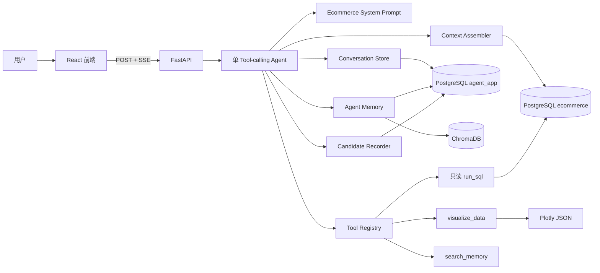
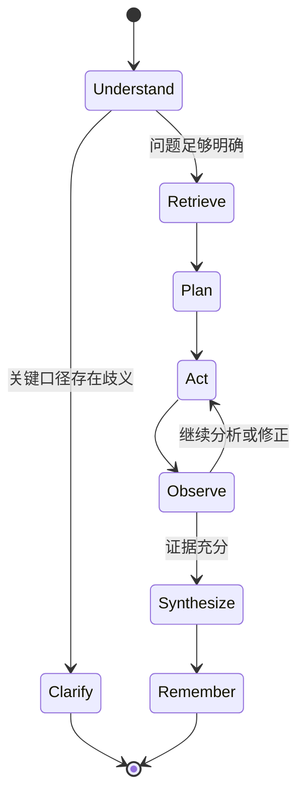
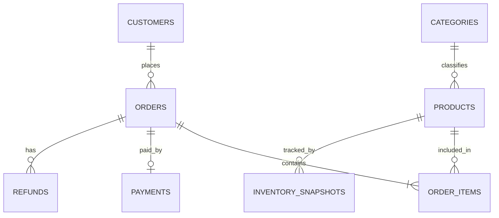

# 中文电商经营分析 Data Agent 设计文档

> 2026-07-26 实现决策：当前本地 MVP 不使用 Docker 或 PostgreSQL，改用 Python 标准库 SQLite。`ecommerce` 与 `agent_app` 通过附加数据库文件保持边界，业务查询连接强制 `PRAGMA query_only=ON`。下文原 PostgreSQL 描述保留为早期设计背景，如有冲突以此实现决策为准。

日期：2026-07-25

状态：已确认，待编写实现计划

## 1. 项目定位

本项目是一个面向中文电商经营分析的轻量 Data Agent，用于展示 AI 应用、Agent 工程与 Python 后端能力。

系统借鉴 Vanna 2.0 的单 Agent Tool-calling、工具记忆和流式组件设计，但不直接 Fork 或裁剪 Vanna。项目将在独立代码库中重新实现，并聚焦两条产品主线：

1. 多步经营归因：能够将“销售额为什么下降”一类问题拆解为有限的分析步骤，通过多次只读 SQL 查询形成有证据的结论。
2. 持续工具记忆：自动积累被最终答案引用的成功工具经验，并区分未经验证的 Candidate 与通过 Golden Case 回放的 Trusted Memory。

可靠性、可追踪性、执行反馈、自我修正和可复现评测是支撑上述主线的核心能力。

第一版计划在 8 周、约 100 小时内完成。达到时间上限后停止扩展范围，优先保证完整演示、测试、评测和文档。

## 2. 设计原则

- 采用单 Agent Tool-calling 循环，不使用 LangChain、LangGraph 或多 Agent。
- 只支持一个业务数据库 PostgreSQL。
- 只支持一个原生 Tool Calling 的 OpenAI-compatible LLM 客户端。
- 主要交互语言、业务知识和评测问题使用中文；数据库标识符使用英文。
- 固定注入小型完整 Schema，不实现 Schema Selector。
- PostgreSQL 和版本库知识文件是权威事实源，ChromaDB 是可重建检索索引。
- SQL 成功执行不等于语义正确；自动经验只能进入 Candidate。
- 最终定量结论必须引用已执行查询产生的证据。
- PostgreSQL 权限和应用层 AST 校验共同保证只读。
- 不展示模型隐藏思维，只展示结构化计划、工具状态和证据。
- 采用 Docker Compose 一键启动，不引入生产级分布式基础设施。

## 3. 方案比较与选择

### 3.1 候选方案

| 方案 | 核心流程 | 优点 | 缺点 |
|---|---|---|---|
| 固定 RAG Pipeline | 检索 DDL、文档、相似 SQL 后一次生成 SQL | 简单、低延迟、易评测 | Agent 能力弱，不适合多步归因 |
| 单 Tool-calling Agent | 检索记忆，循环执行 SQL、观察、修正、可视化 | 支持多步归因、持续记忆和执行反馈 | 状态、成本和调试更复杂 |
| 多 Agent 协作 | Planner、SQL Agent、Reviewer 分工 | 角色清楚 | 调用成本高、链路长，第一版过度设计 |

### 3.2 选定方案

选择单 Tool-calling Agent：

```text
中文问题
  → Ecommerce System Prompt
  → 完整压缩 Schema
  → 自动检索业务知识和工具经验
  → 单 Agent Tool Loop
      ├─ run_sql
      ├─ visualize_data
      └─ search_memory
  → 后端登记被最终证据采用的 Candidate
  → 分析计划、证据轨迹、结论和图表
```

## 4. 总体架构



### 4.1 React 前端

负责聊天输入、对话历史、分析计划、工具状态、证据卡片、结果表格和 Plotly 图表。交互层级参考 Vanna 2.0 的 Task Tracker、Status Bar、Status Card、DataFrame 和 Plotly Component，但不复刻其框架无关 Web Component 与 Storybook 工程。

### 4.2 FastAPI API 层

负责匿名 Cookie 身份、会话归属、请求校验、SSE 事件流和依赖装配。API 层不包含 Agent 决策。

### 4.3 Agent Core

维护显式状态、工具循环、调用预算、分析计划、证据集合和终止条件。

### 4.4 Tool Registry

提供记忆检索、只读 SQL和结构化可视化。所有工具参数均通过 Pydantic 模型校验。Candidate 保存不是 LLM 工具，而是在最终证据确定后由后端执行。

### 4.5 存储

- PostgreSQL `ecommerce` Schema：只读电商业务数据。
- PostgreSQL `agent_app` Schema：匿名用户、对话、消息、工具轨迹、证据和记忆登记。
- ChromaDB：业务知识和工具经验的派生向量索引。

`run_sql` 使用的数据库角色只能读取 `ecommerce`，不能访问 `agent_app`。

## 5. Agent 工作流与状态模型

### 5.1 状态

```text
AgentState
├─ conversation_id
├─ request_id
├─ user_question
├─ analysis_plan[]
├─ current_step
├─ retrieved_context
├─ tool_iterations
├─ business_sql_calls
├─ sql_retry_counts
├─ evidence[]
├─ generated_components[]
└─ status
```

### 5.2 状态流转



### 5.3 各阶段职责

1. Understand：识别指标、维度、时间范围、比较基准和请求是否属于电商分析。
2. Clarify：仅在销售额口径、时间范围或比较对象会实质改变结果且无法确定时追问。
3. Retrieve：确定性注入 Schema，并自动检索业务规则、Trusted SQL 和少量 Candidate。
4. Plan：简单问题生成一个步骤；归因问题生成最多五个可展示步骤。
5. Act：LLM 通过原生 Tool Calling 选择工具。
6. Observe：将查询结果摘要或安全化错误返回 Agent。
7. Synthesize：只基于证据账本生成结论。
8. Remember：后端从最终 Evidence 引用的成功 SQL 中自动登记 Candidate，不依赖 LLM 额外调用保存工具。

### 5.4 调用预算

- 每个请求最多 10 轮工具调用。
- 最多执行 5 次业务 SQL。
- 同一目的的 SQL 最多修正 2 次。
- 达到上限后返回已有证据、未完成步骤和停止原因。

## 6. System Prompt 与上下文

### 6.1 System Prompt 的稳定内容

自定义 `EcommerceSystemPromptBuilder`，而不是直接替换 Vanna 的 `base_prompt`。Prompt 包含：

- 电商经营分析助手角色。
- 先加载上下文、再执行工具的工作约束。
- 销售额、订单、退款等关键口径存在歧义时必须澄清。
- 不猜测数据库值，不编造查询结果。
- 只执行 PostgreSQL 只读查询。
- 多步归因只能描述主要相关因素或贡献，不宣称严格因果。
- 最终结论必须引用 Evidence。
- Agent 不调用记忆保存工具；后端只把最终 Evidence 采用的成功 SQL登记为 Candidate。
- 输出先给结论，再给证据、图表和口径说明。

### 6.2 固定完整 Schema

数据库仅有约 8 张业务表。每次请求固定注入压缩后的全部 Schema：

- 表名和中文说明。
- 字段名、类型和中文含义。
- 主键和外键关系。
- 必要的固定枚举。
- Schema 版本和指纹。

Schema 从 PostgreSQL 元数据生成，不进入向量检索，不实现 Schema Selector。

### 6.3 首轮确定性检索

第一次 LLM 调用前由 Context Assembler 自动完成：

```text
完整压缩 Schema
+ 相关业务规则和指标
+ Trusted SQL
+ 最多 2 条 Candidate 经验
```

核心上下文不依赖 Agent 是否记得调用检索工具。多步归因过程中仍可用 `search_memory` 按“原始问题＋当前步骤”继续检索。

## 7. 业务知识与持续记忆

### 7.1 权威事实源

```text
knowledge/
├─ rules/*.md
├─ metrics/*.yaml
└─ golden_sql/*.yaml
```

- Schema 的权威来源是 PostgreSQL `ecommerce`。
- 业务规则、指标和 Golden SQL 的权威来源是版本库知识文件。
- 运行时候选经验的权威来源是 PostgreSQL `agent_app.memory_records`。
- ChromaDB 只负责召回，可通过 `rebuild-memory-index` 删除后重建。

### 7.2 ChromaDB 索引

使用嵌入式 ChromaDB 和唯一 Embedding 模型 `BAAI/bge-small-zh-v1.5`：

```text
business_memory_index
tool_memory_index
```

业务知识块同时包含中文说明和英文数据库标识符。Schema 本身不进入 ChromaDB。

### 7.3 记忆状态

```text
candidate → trusted
    │          │
    ├────────→ stale
    └────────→ rejected
```

- Candidate：SQL 安全执行成功，且结果被最终答案引用为证据。它是未验证经验。
- Trusted：预置 Golden SQL，或 Candidate 通过已知标准答案的离线回放。
- Stale：Schema 指纹、指标版本或涉及字段已变化。
- Rejected：安全校验失败、标准答案回放失败，或经验被后续执行明确否定。

不强制用户确认。任意真实问题没有标准答案时，其经验不会仅凭多次执行成功自动晋升 Trusted。人工审核标注页面属于后续版本。

### 7.4 Candidate 使用约束

- 每次最多召回 2 条。
- 排名权重始终低于 Trusted。
- 在 Prompt 中明确标注为未验证历史经验。
- 使用前检查 Schema 指纹和指标版本。
- SQL 每次重新校验和执行，不复用历史查询结果。

### 7.5 记忆记录字段

```text
question
analysis_step
normalized_sql
tables_and_columns
schema_fingerprint
metric_versions
execution_time
row_count
column_names
limited_summary
result_hash
status
created_at
last_verified_at
```

不保存完整结果，不向量化模型思维、失败轨迹和临时探索文本。

### 7.6 冷启动

`bootstrap-memory` 读取知识文件和预置 Golden SQL，写入 PostgreSQL 记忆登记表并重建 ChromaDB 索引。

## 8. 值级探索

第一版不实现 `search_column_values`、`resolve_entity` 或独立实体向量索引。

当 Agent 不确定低基数列中的真实数据库值时，使用通用只读 SQL：

```sql
SELECT DISTINCT allowed_column
FROM allowed_table
LIMIT 50;
```

约束如下：

- 只允许配置白名单中的低基数、非敏感列。
- 主要覆盖品类、地区、渠道、订单状态和支付方式。
- 客户姓名、地址、联系方式等敏感字段禁止探索。
- 候选集合仍存在实质歧义时向用户澄清。
- 商品级自由文本实体解析不属于第一版范围。

该设计沿用 Vanna 的中间 SQL/通用 `run_sql` 探索思想，而不是新增专用实体解析系统。

## 9. SQL 工具与安全

### 9.1 工具参数

```json
{
  "sql": "SELECT ...",
  "purpose": "比较各地区对销售额降幅的贡献",
  "expected_columns": ["region", "revenue_change"]
}
```

`purpose` 用于关联分析步骤、证据和后续工具记忆。

### 9.2 应用层保护

- 使用 PostgreSQL 方言 SQL AST 解析器。
- 只允许单条 `SELECT`、`WITH ... SELECT` 和受控 `EXPLAIN`。
- 禁止 DDL、DML、多语句和危险函数。
- 禁止访问 `agent_app` 和非允许 Schema。
- 允许只读访问必要的 PostgreSQL元数据。
- 普通查询最多返回 500 行。
- 白名单 `SELECT DISTINCT` 探索最多返回 50 个值。
- 工具参数通过 Pydantic 校验。

### 9.3 数据库层保护

- 使用仅有 `ecommerce` 读取权限的独立角色。
- 数据库事务设置为只读。
- 设置 `statement_timeout`。
- 使用连接池。
- 不向 LLM 暴露连接字符串、用户或密码。

### 9.4 工具结果

成功结果：

```text
columns
row_count
preview
execution_time
result_hash
```

失败结果：

```text
safe_error_code
safe_error_message
retryable
```

数据库错误经过脱敏后返回 Agent。空结果不自动判错，Agent可检查筛选条件、探索白名单候选值或确认当前条件确实无数据。

## 10. 证据账本与归因

### 10.1 Evidence

```text
evidence_id
analysis_step
tool_call_id
claim
sql
columns
row_count
result_hash
executed_at
```

每个最终定量结论必须引用一个或多个 `evidence_id`。前端可以展开对应 SQL、表格、执行时间和结果哈希。

### 10.2 多步归因边界

支持有限的描述性归因：

```text
确认总体变化
→ 拆分订单量与客单价
→ 按地区和品类分析贡献
→ 检查取消、退款和库存影响
→ 汇总主要相关因素
```

- 只分析预定义电商维度和指标。
- 每个问题最多 5 次业务 SQL。
- 结论必须引用查询证据。
- 使用“主要相关因素”“贡献”或“数据表明”。
- 不实现预测模型、严格因果推断或通用数据科学平台。

## 11. 可视化

`visualize_data` 接收结构化参数，返回受控 Plotly JSON，不执行任意 Python：

- `metric_card`
- `bar`
- `line`
- `pie`

后端验证图表所引用的横轴、纵轴和指标确实存在于对应查询结果中。

## 12. 业务数据模型与生成

### 12.1 数据模型



表职责：

- `customers`：客户、地区、注册时间、获客渠道。
- `categories`：商品品类。
- `products`：商品、当前售价、当前成本和品类。
- `orders`：订单时间、状态、客户和渠道。
- `order_items`：数量、成交单价和成交时成本。
- `payments`：支付时间、支付方式和支付金额。
- `refunds`：退款时间、原因和退款金额。
- `inventory_snapshots`：商品每日库存。

### 12.2 默认规模

```text
20,000 customers
20 categories
2,000 products
100,000 orders
约 300,000 order_items
约 80,000 payments
约 10,000 refunds
每日 inventory snapshots
```

### 12.3 生成方式

固定随机种子和 YAML 配置驱动生成器，使用 Faker 生成中文展示数据、NumPy 生成受控分布、PostgreSQL `COPY` 批量导入。仓库只提交生成器、配置、种子和场景清单，不提交完整数据文件。

### 12.4 植入场景

1. 某月华东地区订单量下降，引发整体销售额下降。
2. 数码品类退款率升高，侵蚀净收入和利润。
3. 信息流渠道新客增长，但后续复购率较低。
4. 部分商品库存不足，增加取消订单并影响销售。

场景通过调整上游订单量、退款概率、复购概率和库存变化产生，而不是事后硬改聚合结果。

### 12.5 数据验证

- 主外键完整。
- 支付、退款与订单状态一致。
- 订单金额能由明细重算。
- 植入异常达到配置的最小效果。
- Golden Case 结果稳定。
- 相同种子产生相同结果哈希。

## 13. 对话、身份与存储

第一版不实现注册登录。首次访问由后端生成匿名 `user_id` 并写入安全 Cookie。

PostgreSQL `agent_app` 至少保存：

- anonymous_users
- conversations
- messages
- tool_calls
- tool_results
- evidence
- memory_records

所有对话查询按 `user_id` 隔离。ChromaDB 不保存完整对话；对话需要精确 ID、时间排序、分页和回放，不属于向量检索问题。

## 14. 前端与 SSE

### 14.1 页面

- 左侧对话历史和新建对话。
- 中间聊天消息。
- 分析计划与步骤进度。
- 工具状态。
- 证据卡片。
- DataFrame 表格。
- Plotly 图表。
- 最终中文结论。

完整 SQL、工具参数和技术错误默认折叠。模型隐藏思维、Prompt 全文、密钥和连接信息永不展示。

### 14.2 事件流

前端使用 `fetch()` 发起 POST，并解析 `text/event-stream`：

```text
conversation.started
context.retrieved
plan.created
plan.step_started
tool.started
tool.completed
tool.failed
evidence.created
chart.created
answer.delta
answer.completed
request.failed
```

所有事件包含：

```text
event_id
conversation_id
request_id
timestamp
payload
```

前端按 `event_id` 去重。第一版不实现跨进程断点续传。

## 15. 评测体系

### 15.1 数据集

约 60 个中文问题：

```text
25 个单表、聚合、趋势和 Top-N
15 个多表 Join 与业务指标
10 个多步经营归因
 5 个歧义澄清与无法回答
 5 个危险 SQL 与越权请求
```

预置 Trusted Memory 与最终评测集分离。评测问题及其表达方式不会提前写入记忆。

### 15.2 指标

- 执行结果正确率。
- 多步归因因素命中率和贡献比例误差。
- SQL 首次执行成功率。
- SQL 自我修正成功率。
- 澄清触发准确率。
- 危险 SQL 拦截率。
- 定量结论证据引用完整率。
- Trusted/Candidate Recall@K。
- 平均 LLM 与工具调用次数。
- 延迟和 Token 消耗。
- Candidate 污染率。

真实标签来自 Golden SQL、结果哈希和场景断言，不以 LLM Judge 作为主要标签。

### 15.3 持续记忆实验

```text
Cold Run
→ 清空 Candidate
→ 执行第一组问题
→ 自动积累 Candidate

Warm Run
→ 使用语义相近但表达不同的第二组问题
→ 测量正确率、调用次数和污染率变化
```

不使用“重复询问完全相同问题”证明记忆有效。

### 15.4 消融实验

```text
A：完整 Schema＋System Prompt
B：A＋业务规则和 Trusted SQL
C：B＋执行反馈与自我修正
D：C＋Candidate 持续记忆
```

### 15.5 第一版目标

- 总体执行结果正确率不低于 80%。
- 多步归因问题正确率不低于 70%。
- 危险 SQL 测试拦截率 100%。
- 定量结论证据引用完整率 100%。
- Candidate 不导致 Warm Run 正确率下降。
- 固定种子和配置下能生成 Markdown 与 JSON 评测报告。

这些是验收目标，只有实际评测完成后才能写成项目成果。

## 16. 项目结构

```text
Data_Agent/
├─ backend/
│  ├─ pyproject.toml
│  ├─ src/data_agent/
│  │  ├─ api/
│  │  ├─ agent/
│  │  ├─ llm/
│  │  ├─ context/
│  │  ├─ memory/
│  │  ├─ tools/
│  │  ├─ evidence/
│  │  ├─ storage/
│  │  └─ evaluation/
│  └─ tests/
├─ frontend/
│  └─ src/
├─ data_generator/
├─ knowledge/
│  ├─ rules/
│  ├─ metrics/
│  └─ golden_sql/
├─ migrations/
├─ evals/datasets/
├─ docs/
├─ docker-compose.yml
└─ README.md
```

## 17. 测试策略

### 17.1 单元测试

- Agent 状态流转与调用预算。
- Prompt 和上下文组装。
- SQL AST 只读校验。
- Evidence 引用完整性。
- Memory 状态、版本、指纹和去重。
- SSE 事件模型。
- 合成数据业务约束。

### 17.2 集成测试

- PostgreSQL 只读角色阻止写操作。
- Conversation Store 用户隔离。
- ChromaDB 索引删除后可重建。
- SQL 错误返回 Agent 并触发修正。
- Candidate 通过 Golden 回放晋升或拒绝。
- 图表字段来自真实查询结果。

### 17.3 端到端与模型评测

- 使用确定性 Fake LLM 测试完整工具循环。
- 真实模型测试单独标记，不进入普通快速测试。
- 正式评测固定数据种子、模型参数、Prompt 版本和知识版本。

## 18. Docker 部署

```text
Docker Compose
├─ postgres
├─ backend
│  └─ embedded ChromaDB
└─ frontend
```

持久化卷：

- `postgres_data`
- `chroma_data`

首次初始化：

```text
数据库迁移
→ 合成数据生成与 COPY
→ 数据场景验证
→ bootstrap-memory
→ rebuild-memory-index
→ 启动 API 和前端
```

## 19. 8 周交付计划

| 周次 | 交付内容 |
|---|---|
| 第 1 周 | 工程骨架、Docker、PostgreSQL Schema、数据生成器 |
| 第 2 周 | OpenAI-compatible 客户端、Tool Calling Agent、SSE |
| 第 3 周 | 完整 Schema 上下文、业务知识源、ChromaDB 派生索引 |
| 第 4 周 | 只读 SQL、安全校验、执行反馈、自我修正、证据账本 |
| 第 5 周 | 分析计划、多步归因、Candidate Memory 状态 |
| 第 6 周 | 参考 Vanna 交互完成 React 前端和 Plotly |
| 第 7 周 | 评测集、Golden 结果、消融实验和记忆实验 |
| 第 8 周 | 测试补强、性能检查、README、架构图、演示和简历描述 |

## 20. 明确不做

- PostgreSQL 之外的业务数据库。
- 多 LLM 厂商适配器。
- LangChain、LangGraph 和多 Agent。
- 注册、登录、OAuth 和复杂权限。
- 行级权限、多租户、配额和计费。
- 任意 Python、Shell 或文件执行。
- 预测模型、推荐系统和严格因果推断。
- 语音、文件上传和联网搜索。
- 移动端 App。
- Kubernetes、Redis、消息队列和微服务。
- 通用 Prompt 管理平台。
- 多向量库适配器。
- 商品级通用实体解析。
- 生产级高并发和高可用。
- 第一版人工记忆审核页面。

## 21. 完成标准

- Docker Compose 能从空环境启动。
- 用户能用中文完成简单查询和有限多步归因。
- 对话、工具轨迹和证据可回放。
- Candidate 与 Trusted Memory 边界明确。
- ChromaDB 索引可从权威事实源重建。
- 危险 SQL 被应用和数据库双层阻止。
- 评测与消融报告可复现。
- README 清楚说明借鉴 Vanna 的部分和自主设计的部分。
- 项目结果只引用真实运行和评测数据，不预先编造准确率提升。
